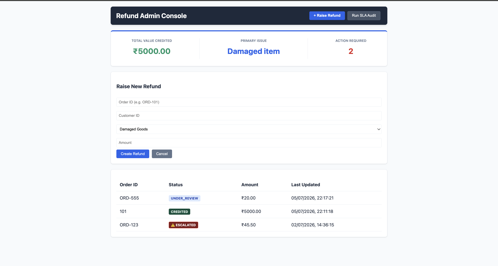

# Refund Lifecycle Tracker

A backend system that models how a refund moves through its lifecycle in a food-delivery-style platform — from being raised by a customer to being settled — while enforcing valid state transitions, protecting against concurrent update conflicts, and keeping a full audit trail of every change.

On a platform processing a high volume of daily orders, refunds are one of the most trust-sensitive flows in the product. A customer disputing a wrong or late order, a support agent reviewing it, and a payment provider settling it all touch the same record — often close together in time. Most refund flows handle this by just updating a status field and hoping nothing overlaps. This project treats a refund as an explicit state machine instead, so every transition is validated, timed, and traceable.

## Dashboard Preview


## The Problem It Models

A refund on an order-based platform doesn't resolve in one step. It's raised, reviewed, approved or denied, handed off for payment processing, and finally settled — and at every one of those stages, something can go wrong: a support agent and an automated system can act on the same refund within milliseconds of each other, a refund can sit unattended past a reasonable SLA while a customer waits, or a step can be skipped that shouldn't be allowed. This project is built specifically around those failure modes, not just the happy path.

## Core Design

**State machine.** A refund can only move through explicitly allowed transitions:

```
RAISED → UNDER_REVIEW → APPROVED → PROCESSING → CREDITED
              ↓
           DENIED

UNDER_REVIEW / APPROVED / PROCESSING → ESCALATED (system-triggered only)
ESCALATED → UNDER_REVIEW (manual recovery)
```

Every transition is checked against this map before it's allowed to happen. Illegal jumps — skipping a step, moving from a terminal state, or attempting a system-only transition manually — are rejected at the API level with a clear error, not silently allowed. This matters on a platform where support agents, automated jobs, and payment callbacks can all try to modify the same refund.

**Optimistic concurrency control.** Each refund row carries a version number. A state change is only committed if the version at write-time still matches what was read — if two requests act on the same refund at once (say, a support agent approving it manually at the exact moment an SLA job tries to escalate it), only one succeeds; the other is rejected with a 409 Conflict instead of silently overwriting the first change. This was verified directly by firing concurrent requests at the same refund and confirming exactly one succeeds while conflicting requests are correctly rejected — not just assumed to work.

**Automated SLA escalation.** A background job checks periodically for refunds that have been sitting in a state longer than their allowed time limit (for example, stuck in review for more than 24 hours) and automatically transitions them to `ESCALATED`. On a platform where a stuck refund directly translates to a frustrated customer, this removes the dependency on a human noticing the delay first. Escalations use the same version-checked write path as manual transitions, so a job running at the same moment a support agent acts on the same refund won't corrupt state.

**Audit trail.** Every transition — manual or automatic — is logged with the from-state, to-state, who or what triggered it, a timestamp, and an optional note. Given how often refund disputes get escalated or questioned after the fact, being able to reconstruct exactly what happened and when is treated as a first-class part of the system, not an afterthought.

**Mock payment webhook.** Moving a refund to `PROCESSING` represents handing it off to a payment provider. A webhook endpoint simulates that provider calling back once the transfer actually completes, automatically advancing the refund to `CREDITED`. This models the real, asynchronous nature of payment settlement rather than assuming the whole refund resolves within a single request-response cycle.

## Tech Stack

- **Backend:** Node.js, Express
- **Database:** MySQL, using connection pooling and transactions for every state-changing write
- **Frontend:** Vanilla HTML/CSS/JS served through Vite
- **Concurrency handling:** Version-based optimistic locking (no external locking library)
- **Scheduling:** A plain interval-based background job for SLA checks (no external cron library)

## What This Project Is Meant to Demonstrate

This isn't a CRUD wrapper around a refunds table — it's an attempt to model the actual operational messiness of refunds on a high-volume order platform:

- Designing and enforcing a state machine at the API layer rather than trusting the caller to send valid data
- Handling concurrent writes correctly in a scenario where a human and an automated system can plausibly race each other
- Running a background process that operates independently of any user request while still writing safely against user-triggered changes
- Treating traceability of every state change as seriously as making the change itself — because in a support/dispute context, "what happened and when" matters as much as "what is the current status"
